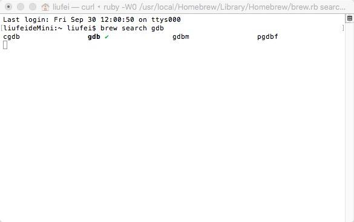
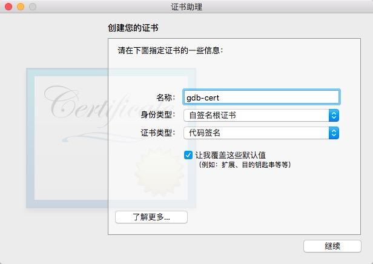
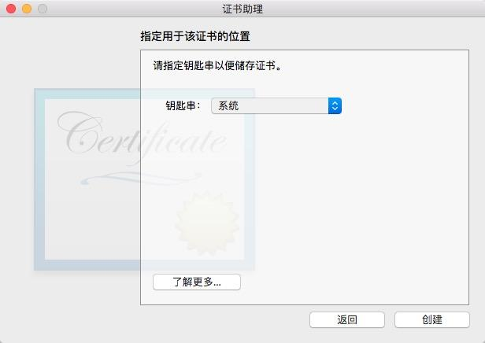

### gdb安装调试

1. 安装

```
1) 安装brew
ruby -e"$(curl -fsSL https://raw.githubusercontent.com/Homebrew/install/master/install)"

2）brew install gdb

3）brew -v 查看安装版本
或者你可以源码编译~
```

2. 创建证书

```
mac 下刚安装完毕，是报证书错误的
1）打开钥匙串，添加证书
```



```
2）填写信息，如下图
```



```
3）一直next直到指定证书类型、默认登录，需要改为系统
```


```
4）在钥匙串的系统选项中查看刚刚创建的gdb-cert证书，双击信任，选择全部信任
```



```
5）以上步骤执行完，证书创建完毕，需要最后一步：
终端执行 sudo codesign -s gdb-cert `which gdb`
```

3. 重新启动电脑

开始gdb调试之旅~

4. 调试c程序：

```
1）在编译的时候一定要加 -g 允许debug文件的生成
2）常用的选项 
list 列出源码 eg list function列出摸个函数的源码
break 设置断点 eg break 12 在第12行设置断点
                  break function 在某个函数的入口处设置断点
info break 显示断点信息
r(run)  允许程序
n(next) 执行单条语句
c(continue) 继续运行
p i 打印i变量的值
bt 查看函数堆栈
finish 退出函数
q 退出gdb调试
```

5. 常见用法：

```
1. 调试C程序，如上
2. 调试core文件
gdb <programe> core 使用gdb调试一个运行程序和core文件,core文件是程序非法执行后产生(具体使用再另一篇文章)
3. 调试进程文件
gdb <program> <pid>
```

gdb 的安装和基本使用就酱紫了、good luck~~

