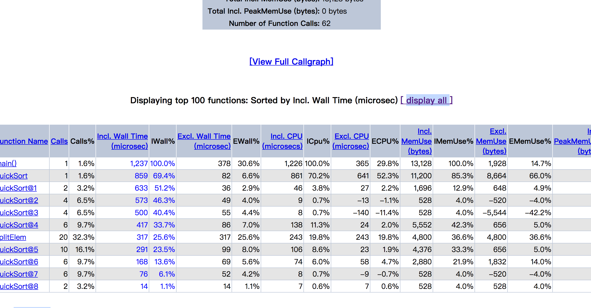

#### php71 xhprof安装使用

##### why is xhprof

```
目前常用的php性能监测工具有xdebug、xhprof、blackfire、oneAPM
xdebug会对应用的性能有影响，即便是开启profiler_enable_trigger参数, 在生产环境中也爱上会有影响
blackfire的功能很强大，但是中文文档比较少，相对学习成本比较高，
按照部署也比较麻烦
oneAPM功能比较强大、部署也比较简单，但是、但是是收费的~~

xhprof或许没有oneAPM的易用和售后，但是，它是免费的呀~
而且，它是facebook的开源产品、性能应该挺不错的，搭建也相对简单，可以使用图形界面，也比较友好，控制也比较灵活，可以自己控制要不要开启，或者指定几率的开启
```

1. 下载安装

```
cd ~/build
git clone https://github.com/yaoguais/phpng-xhprof.git
cd phpng-xhprof/
phpize
./configure --with-php-config=/usr/local/bin/php-config
make && make install
```

编译成功会提示如下：

```
stalling shared extensions:     /usr/local/Celler/php71/php-7.1.6_18/lib/php/extensions/no-debug-non-zts-20160303/
```

2. 添加配置文件

```
vi /usr/local/etc/php/7.1/conf.d/ext-xhprof.conf

[xhprof]
extension=/usr/local/Cellar/php71/7.1.6_18/lib/php/extensions/no-debug-non-zts-20160303/phpng_xhprof.so


Tips: 扩展的位置可以使用 echo $(php-config --extension-dir)来查看
在编译扩展完成后，也会提示扩展位置
```


3. 配置一个web目录

```
#错误日志和访问日志路径
error_log /usr/local/var/log/nginx/xhprof-error.log;
access_log /usr/local/var/log/nginx/xhprof-access.log;

server {
    listen 80;
    server_name xhprof.cc;

    location / {
       #xhrof项目所在目录
        root          /Users/nj/www/php/xhprof;
        index         index.php index.html index.htm;
    }

    location ~ \.php$ {
         root           /Users/nj/www/php/xhprof;
         fastcgi_pass   127.0.0.1:9000; 
         fastcgi_index  index.php;
        #fastcgi_param  SCRIPT_FILENAME  /scripts$fastcgi_script_name;
         fastcgi_param  SCRIPT_FILENAME $document_root$fastcgi_script_name;
         include        fastcgi_params;
    }
}

仅供参考~~~
```

4. 如果是php7及以上的版本，还需额外做一些事。。。

```
它不包含xhprof_lib.php和xhprof_runs.php文件，而这两个文件是xhprof运行的必须文件，所以呢、找一个5.6版本的借用下：

cd ~/build
git clone https://github.com/phacility/xhprof.git
文件在xhprof_lib/utils下，也可以mv|cp到任意你喜欢的地方、下边用到的时候可以找到就OK
```

5. 重启服务

```
1）php
brew services restart php71
2）nginx
sudo nginx -s reload
Mac下的重启、请使用自己的对应方式操作
```

6. 测试扩展

```
1）扩展测试
php -m | grep xhprof
或者
php -i | grep xhprof
2）如果看到xhprof的信息，说明安装成功
```

7. 配置host

```
sudo vi /etc/hosts

添加 127.0.0.1 xhprof.cc到自己的host文件
```

8. 测试文件

```
//这里是cd到自己配置文件对应的目录、index.php也可以是任意文件
cd ~/www/php/xhprof/
vi index.php

<?php
if (isset($_REQUEST['xhprof']) && $_REQUEST['xhprof'] = 1) {
    xhprof_enable(XHPROF_FLAGS_MEMORY | XHPROF_FLAGS_CPU);
    register_shutdown_function(function() {
        $xhprof_data = xhprof_disable();
        if (function_exists('fastcgi_finish_request')) {
            fastcgi_finish_request();
        }
// 注意这里 xhprof_lib|runs.php的位置是自己文件的实际位置，注意修改
        require_once "/Users/nj/build/xhprof/xhprof_lib/utils/xhprof_lib.php";
        require_once "/Users/nj/build/xhprof/xhprof_lib/utils/xhprof_runs.php";
        $xhprof_runs = new XHProfRuns_Default();
        $run_id = $xhprof_runs->save_run($xhprof_data, 'test');
        //直接输出方便查看，实际应用最好写到log文件中
        echo 'http://xhprof.cc/index.php?run=' . $run_id . '&source=test';
        //file_put_contents('/Users/nj/www/php/xhprof/xhprof.txt', 'http://xhprof.cc/index.php?run=' . $run_id . '&source=test'."\n");
    });
}

```

Tips：

```
xhprof_enable的参数说明：
XHPROF_FLAGS_NO_BUILTINS 跳过所有内置函数
XHPROF_FLAGS_CPU         输出的性能数据中添加CPU数据
XHPROF_FLAGS_MEMORY      输出的性能数据添加内存数据
分析输出可以通过XHProfRuns_Default(dirname) 指定位置，如果不指定会读取php.ini的xhprof.output_dir选项值，作为输出
如果仍然未指定，会输出到/tmp文件夹

```

9. 访问测试文件

```
xhprof.cc/index.php?xhprof=1 #xhprof=1代表使用xhprof

看到输出内容：
http://xhprof.cc/index.php?run=596b2e0276752&source=test
证明安装成功、enjoy it ~~~
```

10. 是不是想要图形界面？

```
记得上边clone了xhprof 5.6的文件吧 ？借用了xhprof_runs.php 和 xhprof_lib.php

现在 可以在xhprof下新建文件夹lib
cp -R ~/build/xhprof/xhprof_lib lib/ 非必须
cp -R ~/build/xhprof/xhprof_html ./
修改nginx的配置文件，将root定位到xhprof_html文件夹下
root           /Users/nj/www/php/xhprof/xhprof_html;
重新启动nginx

vi /Users/nj/www/php/xhprof/xhprof_html

修改xhprof_html/index.php xhprof_lib文件夹的位置：(你自己的lib位置)
$GLOBALS['XHPROF_LIB_ROOT'] = dirname(dirname(__FILE__)) . "/lib/xhprof_lib";

访问xhprof.cc/xhprof.php?xhprof=1
打开xhprof.cc/index.php
可以看到xhprof的文件列表、点击进去，可以查看图形界面的详情
```




11. 如何优雅的接入项目

```
只需要在文件的入口处注入代码：
内容如上边的测试文件
遗憾的是，这样还是要修改项目文件、可不可以完全无入侵 ？
答案是肯定的：

修改我们的配置文件
vi /usr/local/etc/php/7.1/conf.d/ext-xhprof.conf

添加内容：
xhprof.output_dir=/Users/nj/xhprof #xhprof分析文件的位置
auto_prepend_file=/Users/nj/www/php/xhprof/xhprof_html/xhprof.php
这样就可以实现完全无入侵的检测了

那假如、我们有很多项目呢 ？ 你只想要分析其中的某一个...
。
。
。
可以，xhprof可以实现基于站点的无入侵注入：
nginx添加
fastcgi_param PHP_CALUE "auto_prepend_file=/Users/nj/www/php/xhprof/xhprof_html/xhprof.php"
到自己的站点配置即可

apache添加：
php_admin_value auto_prepend_file "/Users/nj/www/php/xhprof/xhprof_html/xhprof.php"
这样所有的请求就会自动注入xhprof，基于单个站点，入侵性更小
```

```
12. 图形界面还有xhgui
关于xhprof.io和xhpgui各有优缺，可参考一篇博文：
http://avnpc.com/pages/profiler-php-performance-online-by-xhprof
```


13. 如果你愿意，还可以更优化：

```
1. 指定几率的启用xhprof
if (mt_rand(1, 10000) == 1) {
	xhprof_enable(XHPROF_FLAGS_MEMORY | XHPROF_FLAGS_CPU);
	$xhprof_on = true;
}
...
if ($xhprof_on) {
    // stop
	$xhprof_data = xhprof_disable();
}
注意一点：xhprof并不是严格热监控内存的分配和释放，而是记录每个函数进入和退出时的内存使用状态
```

####问题：

```
1. 如果是php55的版本+xhprof0.94(2)
很可能会遇到 
2017/07/17 23:17:20 [error] 3420#0: *99 recv() failed (104: Connection reset by peer) while reading response header from upstream, client: 10.33.3.37, server: dev.act.you.lianjia.com, request: "POST /customer/getCustomerList HTTP/1.1", upstream: "fastcgi://127.0.0.1:9000", host: "act.cc"
这样的错误，检查fpm的日志，可以发现进程总是重启，这是xhprof的一个bug、

若是request_limit_time导致，可以直接修改为0

若是opcahe导致、可以
-      xhprof_enable(XHPROF_FLAGS_CPU + XHPROF_FLAGS_MEMORY);
+      xhprof_enable(XHPROF_FLAGS_NO_BUILTINS | XHPROF_FLAGS_CPU | XHPROF_FLAGS_MEMORY);
来解决

如果还不能解决，恰好你的php版本是5.5的话，可以
参考https://github.com/phacility/xhprof/commit/55a47c0d8ffeea4b84133fd21103caa816676b5d
修改之后重新编译即可

2. 图像出不来
1）先用的是graphviz 2.26的版本、不支持png格式
2）改为2.24.0 的版本ok
3）其它版本测试 2.40编译失败 环境centos6.5 
```


^(*￣(oo)￣)^ ## 使用顺利

